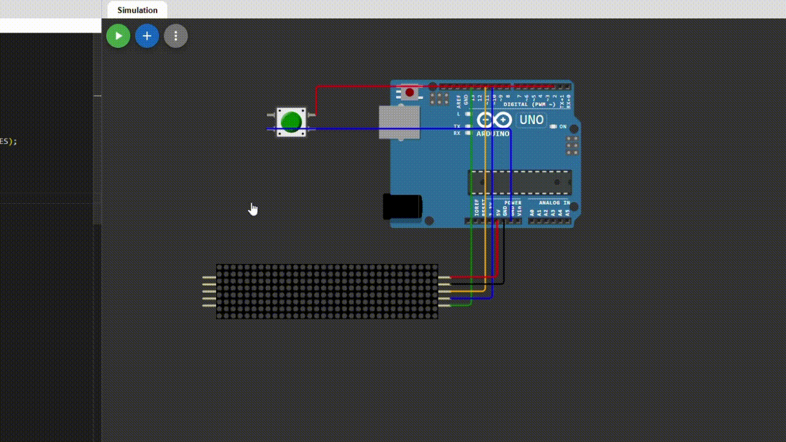

# **Digital In/Out Sign Using Arduino Uno**  

## **Overview ⚙️**  
This is an **Arduino-based project** using a **pushbutton** and an **8x32 LED dot matrix** driven by a **MAX7219 controller**.  

Have you ever needed a door sign that says **"Working", "Sleeping", "In", or "Out"**? Why buy one when you can **build your own**? 😃  

This project lets you cycle through different states with a button press, and you can even **customize the text** to suit your needs!  

---
## Demo 🎬

---

## **Features 🎛️**  
✅ Displays **four default states**: `"Sleeping"`, `"Working"`, `"In"`, and `"Out"`. (Feel free to customize!)  
✅ **Press the button** to cycle through states.  
✅ Works on **real hardware** or an **online simulator**.  

---

## **Getting Started 🚀**  

### **Prerequisites ✅**  
#### **If you don’t have an Arduino:**  
🖥️ No problem! Use an online simulator like [Wokwi](https://wokwi.com/) — that’s how I built it!  

#### **If you have an Arduino:**  
💡 First, try the **Wokwi simulation** using the provided `src` files. If everything works, set up the hardware and install these dependencies:  

#### **Dependencies**  
1️⃣ [MD_Parola](https://github.com/MajicDesigns/MD_Parola)  
2️⃣ [MD_MAX72XX](https://github.com/MajicDesigns/MD_MAX72XX)  

Install these using the **Arduino Library Manager** or manually download them.  

---

## **Wiring 🛠️**  
### **For the LED Matrix**  
| Matrix Pin | Arduino Pin |
|------------|------------|
| **CLK**    | 13         |
| **CS**     | 10         |
| **DIN**    | 11         |
| **GND**    | GND        |
| **VCC**    | 5V         |

### **For the Pushbutton**  
| Button Pin | Arduino Pin |
|------------|------------|
| **1R**     | 2          |
| **2L**     | GND        |

---

## **How to Use 🎮**  
1️⃣ **Ensure the wiring is correct** (see above).  
2️⃣ **Upload the code** (`main.ino`) to your Arduino.  
3️⃣ **Press the button** to cycle through different states.  
4️⃣ The **LED display** will show the selected state.  

---

## **Future Improvements ✨**  
🔹 Build a **portable** version with an enclosure.  
🔹 Replace the **pushbutton** with a **touch sensor** or **remote control** for faster switching.  
🔹 Add a **Bluetooth module** to control the display via a phone app.  

---

## **References 📚**  
🔗 [How to Use the 8x32 Dot Matrix LED](https://how2electronics.com/8x32-max7219-dot-matrix-led-display-with-arduino/)  

---

## **Thank You! 😄**  
Enjoy building your **digital door sign**! 🚀 If you have suggestions or improvements, feel free to contribute.  
